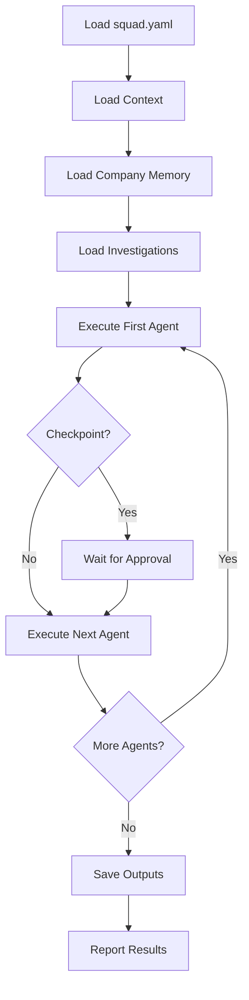

## Overview

The `run` command is used within Claude Code, Cursor, or other supported IDEs to execute a multi-agent squad. This command is not available as a standalone CLI command but is invoked through the `/opensquad` skill interface.

<Note>
This command must be run from within your IDE's chat interface, not from the terminal.
</Note>

## Usage

### In Claude Code

```
/opensquad run <squad-name>
```

### In Cursor

```
/opensquad run <squad-name>
```

### In VS Code + Copilot

```
Ctrl+Alt+I (open Copilot Chat)
/opensquad run <squad-name>
```

## How It Works

When you run a squad, the **Pipeline Runner** agent orchestrates the execution:

1. **Loads squad configuration** from `squads/<name>/squad.yaml`
2. **Reads memory and context** from `_opensquad/_memory/` and `squads/<name>/_investigations/`
3. **Executes agents sequentially or in parallel** based on dependencies
4. **Handles checkpoints** by pausing for user approval
5. **Saves outputs** to the specified output directory
6. **Reports results** with links to generated content

## Execution Flow



## Example Execution

```
/opensquad run instagram-content

🚀 Running squad: Instagram Content Generator

📋 Loaded configuration: squads/instagram-content/squad.yaml
📚 Loaded company context: _opensquad/_memory/company.md
🔍 Loaded investigation: @competitor_analysis.md

━━━━━━━━━━━━━━━━━━━━━━━━━━━━━━━━━━━━━━━━━━━━━━━

🤖 Agent: Strategist
Task: Analyze trending topics and create content calendar

> Analyzing Instagram trends...
> Identified 3 trending topics in your niche
> Created 7-day content calendar

✅ Completed: Strategist

━━━━━━━━━━━━━━━━━━━━━━━━━━━━━━━━━━━━━━━━━━━━━━━

✋ Checkpoint: Review strategy before proceeding

Output: squads/instagram-content/output/strategy_2026-03-13.md

Approve and continue? (yes/no/edit)
→ yes

━━━━━━━━━━━━━━━━━━━━━━━━━━━━━━━━━━━━━━━━━━━━━━━

🤖 Agent: Designer
Task: Generate Instagram post image based on strategy

> Generating image with DALL-E...
> Applying brand colors and fonts
> Optimizing for Instagram format (1080x1080)

✅ Completed: Designer
Output: squads/instagram-content/output/post_001.jpg

━━━━━━━━━━━━━━━━━━━━━━━━━━━━━━━━━━━━━━━━━━━━━━━

🤖 Agent: Copywriter
Task: Write engaging caption and relevant hashtags

> Analyzing image content...
> Writing caption with brand voice
> Researching trending hashtags

✅ Completed: Copywriter
Output: squads/instagram-content/output/caption_001.md

━━━━━━━━━━━━━━━━━━━━━━━━━━━━━━━━━━━━━━━━━━━━━━━

✨ Squad execution complete!

Generated files:
  📄 squads/instagram-content/output/strategy_2026-03-13.md
  🖼️ squads/instagram-content/output/post_001.jpg
  📝 squads/instagram-content/output/caption_001.md

Ready to post! 🚀
```

## Checkpoint Interactions

When a checkpoint is reached, you have three options:

### Approve

```
Approve and continue? (yes/no/edit)
→ yes
```

Continues execution to the next agent.

### Reject

```
Approve and continue? (yes/no/edit)
→ no

Execution stopped. Review output and run again when ready.
```

Stops execution. You can modify the squad configuration and re-run.

### Edit

```
Approve and continue? (yes/no/edit)
→ edit

What changes would you like to make?
→ Use a more casual tone and add emojis

Re-running agent with feedback...
```

Provides feedback to re-run the current agent with modifications.

## Parallel Execution

Squads can run agents in parallel when tasks are independent:

```yaml
pipeline:
  - agent: Researcher
    task: Gather data
    
  - agent: Instagram Writer
    task: Write Instagram post
    depends_on: [Researcher]
    mode: parallel
    
  - agent: LinkedIn Writer
    task: Write LinkedIn post
    depends_on: [Researcher]
    mode: parallel
    
  - agent: Twitter Writer
    task: Write Twitter thread
    depends_on: [Researcher]
    mode: parallel
```

Execution output:

```
✅ Completed: Researcher

━━━━━━━━━━━━━━━━━━━━━━━━━━━━━━━━━━━━━━━━━━━━━━━

🔀 Executing 3 agents in parallel...

🤖 Instagram Writer | LinkedIn Writer | Twitter Writer

⏳ Instagram Writer (40% complete)
⏳ LinkedIn Writer (65% complete)  
✅ Twitter Writer (done)

✅ All parallel agents complete
```

## Output Organization

Squad outputs are organized by:

1. **Squad directory**: `squads/<name>/output/`
2. **Timestamped files**: `strategy_2026-03-13.md`
3. **Agent-specific subdirectories** (optional): `squads/<name>/output/designer/`

Example structure:

```
squads/blog-pipeline/output/
├── 2026-03-13_research.md
├── 2026-03-13_outline.md
├── 2026-03-13_draft.md
├── 2026-03-13_final.md
└── images/
    ├── hero.jpg
    └── diagram.png
```

## Context Loading

Squads automatically load context from multiple sources:

### Company Memory

```markdown _opensquad/_memory/company.md
# Company Profile

**Company Name:** Acme Digital
**Industry:** SaaS Marketing
**Target Audience:** B2B tech companies
**Brand Voice:** Professional, data-driven, approachable
```

All agents have access to this context.

### User Preferences

```markdown _opensquad/_memory/preferences.md
# Opensquad Preferences

- **User Name:** John Doe
- **Output Language:** English
- **IDEs:** claude-code
- **Date Format:** YYYY-MM-DD
```

Outputs respect your language and format preferences.

### Squad Investigations

```markdown squads/instagram-content/_investigations/@competitor.md
# Instagram Profile Analysis: @competitor

**Profile Type:** Business
**Followers:** 45.3K
**Avg. Engagement:** 4.2%

## Content Patterns
- Posts 3-4 times per week
- Heavy use of carousels (60% of posts)
- Consistent color palette: blue, white, orange
- Educational content performs best

## Tone & Voice
- Casual and conversational
- Uses emojis strategically
- Short, punchy captions (avg. 50-80 words)
- Always includes call-to-action
```

Investigations provide real-world examples for content generation.

## Error Handling

### Agent Failure

```
🤖 Agent: Designer
Task: Generate Instagram image

❌ Error: DALL-E API rate limit exceeded

Retry in 60 seconds? (yes/no)
→ yes

⏳ Waiting 60 seconds...

🔄 Retrying...
✅ Completed: Designer
```

### Missing Dependencies

```
❌ Error: Cannot execute Writer agent
Reason: Depends on Researcher output, but Researcher has not completed

Please run agents in the correct order or fix dependencies in squad.yaml
```

### Invalid Configuration

```
❌ Error: Invalid squad configuration
File: squads/blog/squad.yaml
Line 15: Unknown agent "Proofreader"

Available agents:
  - Strategist
  - Researcher
  - Writer
  - Editor

Fix the configuration and try again.
```

## Performance Monitoring

The runner tracks execution metrics:

```
✨ Squad execution complete!

Execution time: 4m 32s
Agents executed: 5
Checkpoints: 2
Outputs generated: 8 files

Performance breakdown:
  Strategist:    45s
  Researcher:   120s
  Writer:       180s
  Designer:      60s
  Editor:        27s
```

## Running Squads Programmatically

While primarily designed for IDE use, you can also integrate squad execution into automated workflows:

```javascript
import { runSquad } from './_opensquad/core/runner.js';

const result = await runSquad('instagram-content', {
  autoApprove: true,  // Skip checkpoints
  outputDir: './output',
  context: {
    topic: 'AI automation',
    targetDate: '2026-03-15'
  }
});

console.log(result.outputs);
// ['post_001.jpg', 'caption_001.md']
```

## Best Practices

### Test Incrementally

Run squads with checkpoints after each agent to catch issues early:

```yaml
pipeline:
  - agent: Strategist
    checkpoint: true
  - agent: Researcher
    checkpoint: true
  - agent: Writer
    checkpoint: true
```

Once the pipeline works, remove checkpoints for automated execution.

### Use Descriptive Task Instructions

```yaml
# ❌ Vague
- agent: Writer
  task: Write content

# ✅ Specific
- agent: Writer
  task: |
    Write a 1000-word blog post on {topic}.
    Include 3 subheadings, 2 examples, and a CTA.
    Use our professional yet approachable brand voice.
    Optimize for SEO keyword: "{keyword}"
```

### Monitor Output Quality

Review initial squad runs carefully:

1. Check outputs meet quality standards
2. Adjust agent tasks and prompts
3. Add checkpoints where quality varies
4. Fine-tune with investigations

### Archive Old Outputs

```bash
# Create archive directory
mkdir -p squads/instagram-content/archive/2026-02

# Move old outputs
mv squads/instagram-content/output/* squads/instagram-content/archive/2026-02/
```

Keep output directories clean for easier navigation.

## Debugging

Enable verbose logging by setting the `DEBUG` environment variable:

```bash
DEBUG=opensquad:* /opensquad run instagram-content
```

This shows:
- Agent invocation details
- Tool usage
- Context loading
- Error stack traces

## Related Commands

- [npx opensquad create](/api/cli-create) - Create a new squad
- [npx opensquad skills](/api/cli-skills) - Manage skills available to agents
- [npx opensquad agents](/api/cli-agents) - Manage predefined agents
